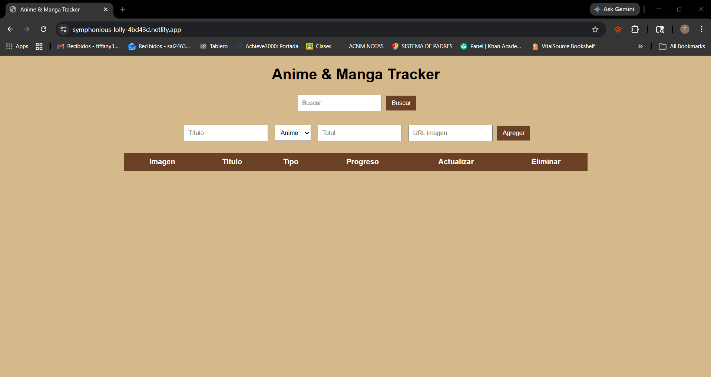

# Anime & Manga Tracker — Frontend

Frontend del proyecto usando HTML, CSS y JavaScript vanilla.

---

# Cómo correr local

Abrir `index.html` o usar:

```
npx serve .
```

---

# Deploy

https://symphonious-lolly-4bd43d.netlify.app 
---

# Screenshot



---

# Challenges implementados

* Fetch API sin librerías
* CRUD completo
* Barra de progreso visual
* UI personalizada
* Integración con API REST

---

# Backend

El backend está en otro repositorio (requerido por el lab):

https://github.com/Tiffany24630/Proyecto-1-Full-Stack.-Web-back-  
---

# Reflexión

Usar JavaScript vanilla fue interesante porque obligó a entender cómo funciona realmente el DOM y las peticiones HTTP sin abstractions. Aunque frameworks como React serían más cómodos para proyectos grandes, para este proyecto fue útil para entender mejor los fundamentos.

La parte más difícil fue manejar el estado manualmente y actualizar la UI después de cada acción.

Sí usaría esta tecnología de nuevo para proyectos pequeños o educativos, pero para algo más grande probablemente usaría un framework.

---
